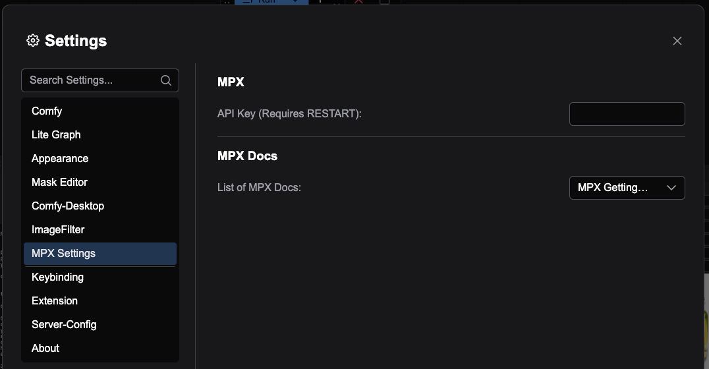

# # MPX ComfyUI Nodes

Welcome to the MPX ComfyUI Nodes repository. These nodes allow you to perform various tasks related to 3D production and design. They enable you to break down an animation script into its props, characters, and scenes, as well as facilitate kitbashing workflows for producing scenes for animatics or conceptual stages in interactive projects. To get started, please ensure that ComfyUI is installed.

# Installing MPX ComfyUI Nodes

Watch this video or follow along with the following instructions.

## Step-by-Step installation instructions

1. Open **ComfyUI**.
2. Open **Comfy Manager**.
3. Click on **Install Nodes via Git URL**.
   

4. Copy and paste the following Git URL to install nodes: https://github.com/withmpx/mpx-comfyui-nodes
5. Restart ComfyUI.
6. Add your Masterpriece X API key in the ComfyUI Settings under **MPX Settings**. If you don’t have a Masterpiece X API key follow the instructions on our documenations page. ([https://docs.masterpiecex.com](https://docs.masterpiecex.com/docs/getting-started#/))
   
7. Restart ComfyUI to access the nodes in the node library.
   

# MPX GenAI Nodes
We have developed 19 ComfyUI Nodes that leverage LLMs, image generation models, and 3D generation models to help you design custom ComfyUI workflows.  Here are the nodes. 

### Text to Image(s)
**Description**: This node takes a text prompt and generates a batch of images. Up to four images can be generated at once.
⠀

### Image(s) to 3D Models(s)
**Description**: This node takes a batch of images (B x H x W x C) and generates a 3D model for each image in the batch. It returns the thumbnails of the generated 3D models as a batch of images and a list of URLs to download each 3D model.
⠀

### Download 3D Models from URL(s)
**Description**: This node takes URLs and downloads the corresponding 3D models to the desired output folder.

### Select from StringList

**Description**: This node takes a list of strings as input and selects one element from the list based on the provided index. An error is thrown if the index is out of bounds.
⠀

### Load Image Data

**Description**: This node loads image data from a given path. The path can point to a single image file, a local folder containing image files, a ZIP file, an image URL, or a URL to a ZIP file. Non-image files are skipped.

### Show List
**Description**: This node visualizes an input list of items as a string.

### Show String
**Description**: This node displays a given string.⠀

### Text to Text
**Description**: This node takes a block of text from the upper text area and transforms it according to the instructions defined in the lower text area.

### Merge Text Blocks
**Description**: This node takes two blocks of text (from the upper and middle text areas) and merges them according to the instructions in the lower text area.
⠀

### Text to String List
**Description**: This node takes text from the upper text area and generates a list of strings, conditioned on the instructions in the lower text area.
⠀
### StringList to Text

**Description**: This node takes a list of strings (for example, one generated by "Text to String List") and combines them into one string according to the provided instructions.
⠀

### Text to Story
**Description**: This node takes:
* A string representing the overall gist of the desired story (upper text area)
* The genre of the story
* The desired length (number of words)It then generates a story along with its characters, ensuring the custom user instructions (from the lower text area) are respected.
⠀

### Script Breakdown
**Description**: This node takes a string representing a story or script and produces:
* A list of characters in the story
* A set of props
* A list of distinct scenes
Each element in these lists is output as a string.
⠀

### Text to ObjectList
**Description**: This node takes a string that describes a scene/environment and produces a list of objects (as strings) that should exist within that scene/environment.

### ObjectList to ObjectList
**Description**: This node takes as input:
* A list of object descriptions.
* A description of the scene/environment that produced the list.It then modifies each element in the list according to the instructions provided in the lower text area. The modification is applied independently to each element.
⠀

### ObjectList to ImageList
**Description**: This node takes a list of object descriptions and generates an image for each element. The images are saved to the default output folder of ComfyUI (e.g., ComfyUI/output).

### Agent: Image Select
**Description**: This node takes a batch of image tensors (B x W x H x C) and selects the "best" image based on the instructions in the lower text area. Additional context (such as the original prompt that generated the images or style information) can also be provided.
⠀
### ReflectionAgent: ImageList
**Description**: This node takes:
* A batch of image tensors (B x W x H x C)
* A corresponding list of object descriptions (one-to-one with each image)
* The original text prompt that generated the object descriptions
* Custom user instructions

It evaluates each image to ensure it is of high quality and adheres to the custom instructions for generating 3D models. If an image fails the checks, a new prompt is generated and used to create a new image.

### StringList to StringList
**Description**: This node allows an LLM to enrich or add more context to a String List, outputting an updated list.

